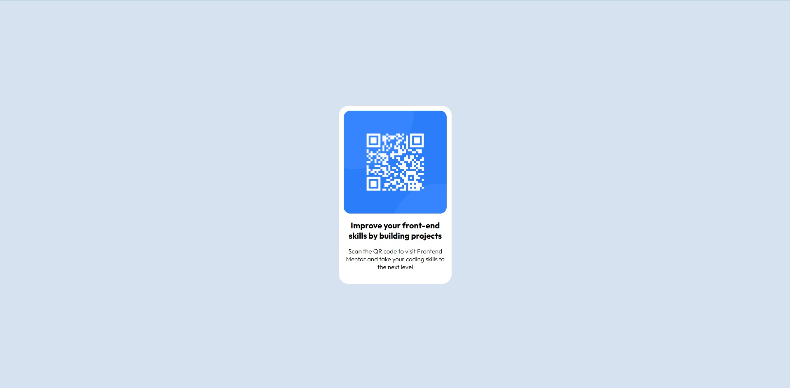

# Frontend Mentor - QR code component solution

This is a solution to the [QR code component challenge on Frontend Mentor](https://www.frontendmentor.io/challenges/qr-code-component-iux_sIO_H). Frontend Mentor challenges help you improve your coding skills by building realistic projects. 

## Table of contents

- [Overview](#overview)
  - [Screenshot](#screenshot)
  - [Links](#links)
- [My process](#my-process)
  - [Built with](#built-with)
  - [What I learned](#what-i-learned)
- [Author](#author)

**Note: Delete this note and update the table of contents based on what sections you keep.**

## Overview

### Screenshot

### Links

- Solution URL: [Add solution URL here](https://github.com/QinisoNgubane/qr-code-component-main.git)
- Live Site URL: [Add live site URL here](https://qinisongubane.github.io/qr-code-component-main/)

## My process

### Built with

- Semantic HTML5 markup
- CSS custom properties
- Flexbox
- CSS Grid
- Mobile-first workflow

**Note: These are just examples. Delete this note and replace the list above with your own choices**

### What I learned

HTML and CSS, the core languages of the web, were the subject of my first actual coding experience.  Learning HTML, or HyperText Markup Language, was similar to learning the framework of a webpage, which specifies the locations of headings, paragraphs, and graphics.  The difficulty soon shifted from deciding which pieces to utilize to figuring out how to properly arrange them to produce a page that is both clear and semantic.

 That structure was then given life by CSS, or Cascading Style Sheets.  All of a sudden, I had power over layouts, colors, and typefaces, turning an ordinary HTML document into something eye-catching.  Understanding the "cascading" element—how several styles interact and supersede one another—was the first challenge..

To see how you can add code snippets, see below:

## Author

- Frontend Mentor - [@yQinisoNgubane](https://www.frontendmentor.io/profile/QinisoNgubanee)

